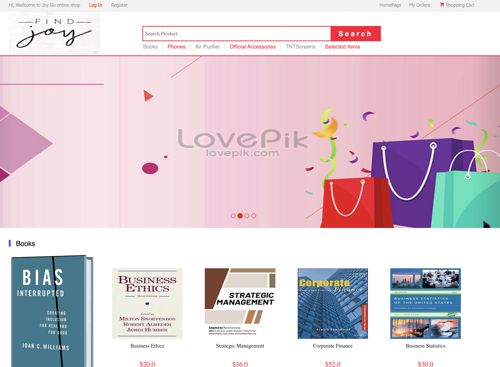
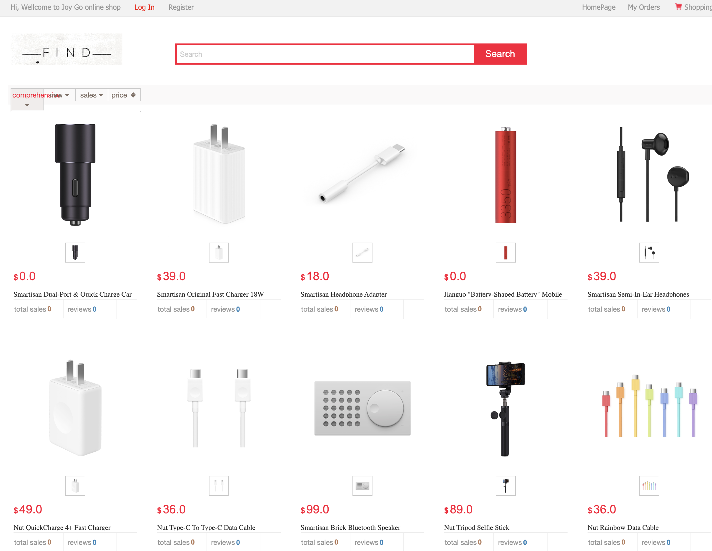
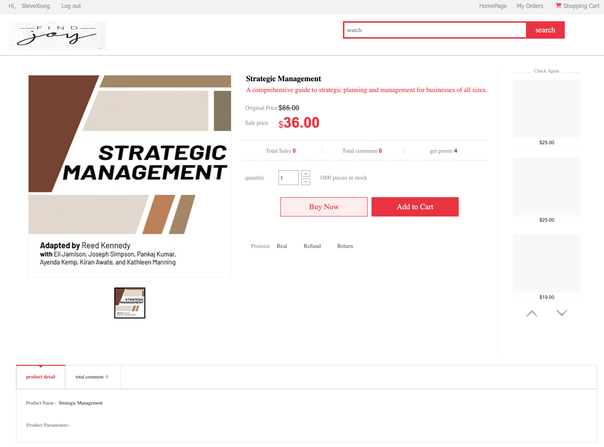
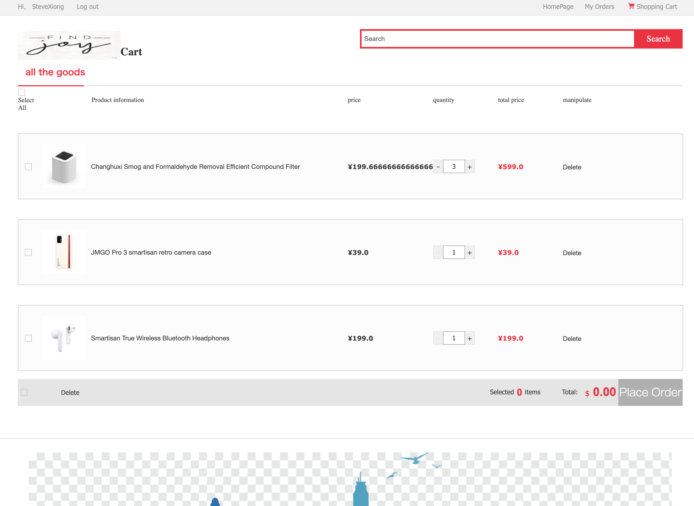
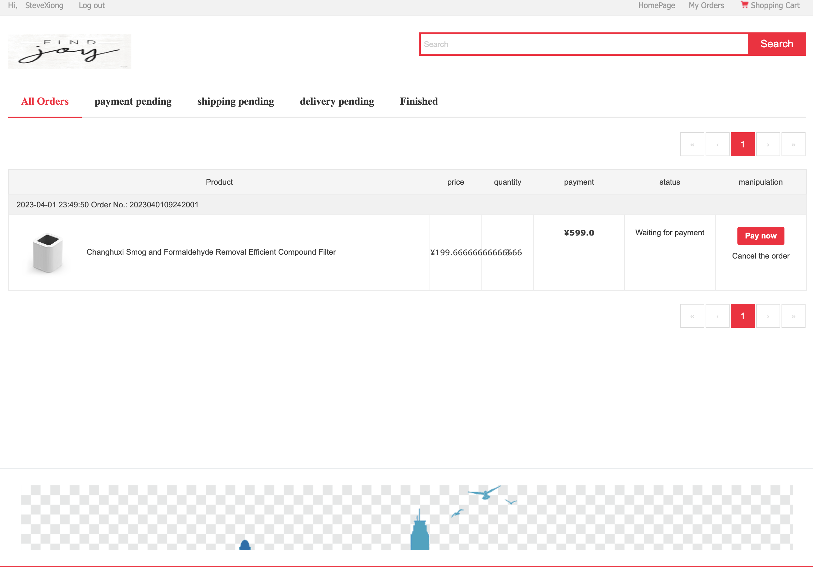

# JoyGo Online Shop

## Introduction
An e-commerce platform based on the Springboot framework

### Technology Utilized
- [x] Backend
  - Springboot      2.1.4
  - Mybatis         3.5.7
  - Mybatis Plus    3.4
  - Druid           1.2.8
  - Mysql           5.6

- [x] Frontend
  - JSP
  - bootstrap
  - jQuery

### HOW TO RUN

### Preview
#### 前台展示
首页

分类

列表

商品

购物车

订单

登录

### 部署
- sql文件目录`documents/db/FinalProjectSQL.sql`，添加到自己的数据库中。
- 修改`src/main/resources/application.yml`文件中数据库连接信息
- 启动`src/main/java/com/uzykj/mall/MallApplication.java`Springboot启动类

### 访问
- 前台地址：[http://127.0.0.1:8080/mall](http://127.0.0.1:8010/mall)

- 后台管理：[http://127.0.0.1:8080/mall/admin](http://127.0.0.1:8010/mall/admin)

### MIT
