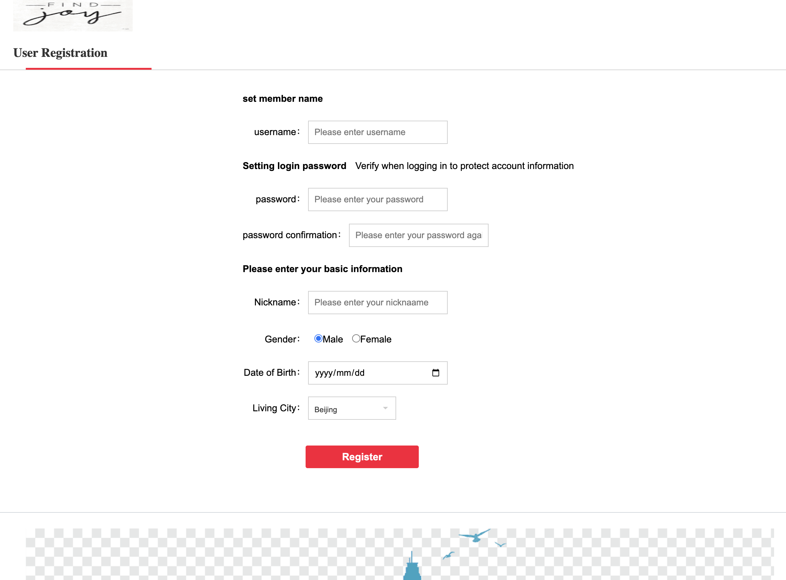

# JoyGo Online Shop

## 1. Introduction
This is the final project for INFSCI 2710 Database management,
An e-commerce platform based on the Springboot framework.

- Group Name: JOY GO

- Group Member: 
  - Chengzhuo Xiong(CHX53)
  - Yutong Tang (YUT89)

### 2. Technology Utilized
- [x] Backend
  - Springboot      2.1.4
  - Mybatis         3.5.7
  - Mybatis Plus    3.4
  - Druid           1.2.8
  - Mysql           5.6

- [x] Frontend
  - JSP
  - bootstrap
  - jQuery

### 3. HOW TO RUN

- 3.1 This project was built by [Maven](https://maven.apache.org/),
it is easy to apply all the dependencies(See `pom.xml`) based on Maven.
Therefore, it is suggested that maven be downloaded bofore you test this project.
- 3.2 Enter `pom.xml` file and refresh. Maven would download all the dependencies.
- 3.3 Get database ready: 
  - the sql is in `documents/db/FinalProjectSQL.sql`. 
  - update the information of the DBMS in: `src/main/resources/application.yml`
  - Since the data and DBMS have already been set up before, 3.3 can be skipped.
- 3.4 Start the Driver
  - Open `src/main/java/com/uzykj/mall/MallApplication.java` in the project and run it!

### 4. Get Access and Try it!
- URL：[http://127.0.0.1:8080/mall](http://127.0.0.1:8010/mall)
- Account information to log in for general users:
  - username: SteveXiong, Password: 123456
  - username: TomaTang, Password: 123456

### 5. Preview

- Homepage

- category

- product

- registration
  

- login
  

- shopping cart

- orders

